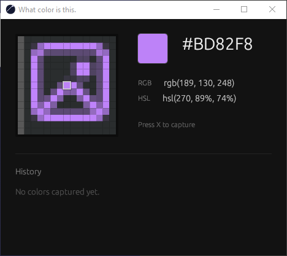

# whatcolor

pick a color off your screen to get the hex and stop wasting your time.

windows only for now

## why

I was designing something, staring at a reference, and I couldn't tell if a color was `#FFF`, `#EAEAEA`, or some other greyish color. Whatever, I'll just check it real quick.

Except "real quick" turned into: open MS Paint? no. open all of Photoshop to sample one (1) pixel? absolutely not. oh wait, JC Picker exists, it's perfect, I've used it before, but I can't find it anywhere on this machine, it's not in my search bar, so now I'm redownloading a whole program to look at a color for two seconds.

one minute gone. to check if something is `#FFF`.

so I made this instead, because why not. open the app, press x, click, and done, hex is on your clipboard, get back to work.

(unless there's already a faster way to do this that I just don't know about yet. if there is, don't tell me, let me have this)

## how it works

Press x from literally anywhere, when the app is open. The window will always appear on top so you dont waste another 1 second to display it when its hidden by another window, you get a zoomed-in view of the pixel under it, click, and the hex is already copied to your clipboard.

last 10 colors you picked are sitting right there too, in case you fat-fingered the click.

## license

MIT. do what you want with it.